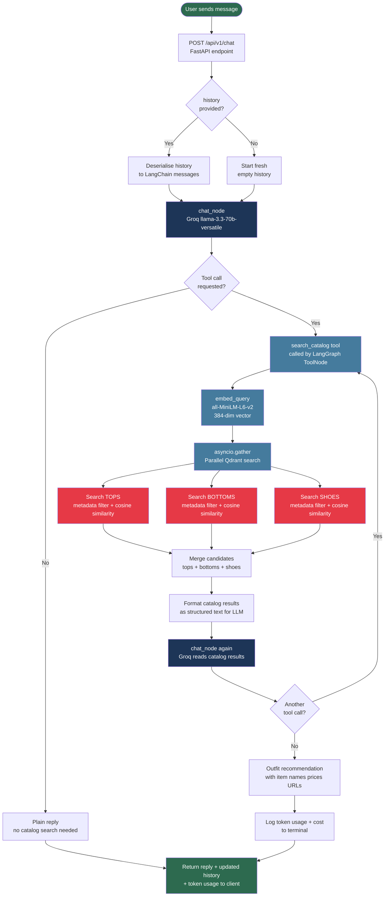
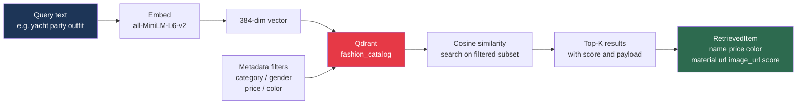
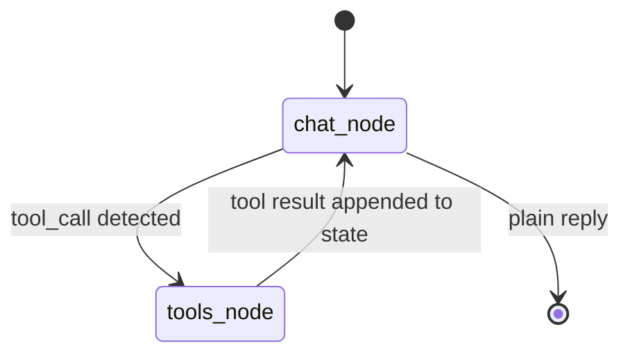

# System Flowchart

```mermaid
flowchart TD
    A([User sends message]) --> B[POST /api/v1/chat\nFastAPI endpoint]

    B --> C{history\nprovided?}
    C -- Yes --> D[Deserialise history\nto LangChain messages]
    C -- No --> E[Start fresh\nempty history]
    D --> F
    E --> F

    F[chat_node\nGroq llama-3.3-70b-versatile] --> G{Tool call\nrequested?}

    G -- No --> H[Plain reply\nno catalog search needed]
    H --> I[Return reply + updated history\n+ token usage to client]

    G -- Yes --> J[search_catalog tool\ncalled by LangGraph ToolNode]

    J --> K[embed_query\nall-MiniLM-L6-v2\n384-dim vector]

    K --> L[asyncio.gather\nParallel Qdrant search]

    L --> M1[Search TOPS\nmetadata filter + cosine similarity]
    L --> M2[Search BOTTOMS\nmetadata filter + cosine similarity]
    L --> M3[Search SHOES\nmetadata filter + cosine similarity]

    M1 --> N[Merge candidates\ntops + bottoms + shoes]
    M2 --> N
    M3 --> N

    N --> O[Format catalog results\nas structured text for LLM]

    O --> F2[chat_node again\nGroq reads catalog results]

    F2 --> P{Another\ntool call?}
    P -- Yes --> J
    P -- No --> Q[Outfit recommendation\nwith item names prices URLs]

    Q --> R[Log token usage + cost\nto terminal]
    R --> I

    style A fill:#2d6a4f,color:#fff
    style I fill:#2d6a4f,color:#fff
    style F fill:#1d3557,color:#fff
    style F2 fill:#1d3557,color:#fff
    style J fill:#457b9d,color:#fff
    style K fill:#457b9d,color:#fff
    style L fill:#457b9d,color:#fff
    style M1 fill:#e63946,color:#fff
    style M2 fill:#e63946,color:#fff
    style M3 fill:#e63946,color:#fff
```

## RAG Retrieval Detail

```mermaid
flowchart LR
    A[Query text\ne.g. yacht party outfit] --> B[Embed\nall-MiniLM-L6-v2]
    B --> C[384-dim vector]

    C --> D[Qdrant\nfashion_catalog]

    E[Metadata filters\ncategory / gender\nprice / color] --> D

    D --> F[Cosine similarity\nsearch on filtered subset]
    F --> G[Top-K results\nwith score and payload]

    G --> H[RetrievedItem\nname price color\nmaterial url image_url score]

    style A fill:#1d3557,color:#fff
    style D fill:#e63946,color:#fff
    style H fill:#2d6a4f,color:#fff
```

## Agent State Graph

```mermaid
stateDiagram-v2
    [*] --> chat_node
    chat_node --> tools_node : tool_call detected
    chat_node --> [*] : plain reply
    tools_node --> chat_node : tool result appended to state
```